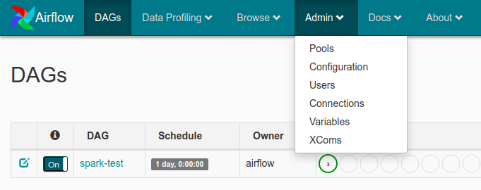

# Airflow Spark

This project contains the following containers:

* postgres: Postgres database for Airflow metadata and a Test database to test whatever you want.
    * Image: postgres:9.6
    * Database Port: 5432
    * References: https://hub.docker.com/_/postgres

* airflow-webserver: Airflow webserver and Scheduler.
    * Image: docker-airflow-spark:1.10.7_3.1.2
    * Port: 8282

* spark: Spark Master.
    * Image: bitnami/spark:3.1.2
    * Port: 8181
    * References: 
      * https://github.com/bitnami/bitnami-docker-spark
      * https://hub.docker.com/r/bitnami/spark/tags/?page=1&ordering=last_updated

* spark-worker-N: Spark workers. You can add workers copying the containers and changing the container name inside the docker-compose.yml file.
    * Image: bitnami/spark:3.1.2
    * References: 
      * https://github.com/bitnami/bitnami-docker-spark
      * https://hub.docker.com/r/bitnami/spark/tags/?page=1&ordering=last_updated

* jupyter-spark: Jupyter notebook with pyspark for interactive development.
  * Image: jupyter/pyspark-notebook:spark-3.1.2
  * Port: 8888
  * References: 
    * https://hub.docker.com/layers/jupyter/pyspark-notebook/spark-3.1.2/images/sha256-37398efc9e51f868e0e1fde8e93df67bae0f9c77d3d3ce7fe3830faeb47afe4d?context=explore
    * https://jupyter-docker-stacks.readthedocs.io/en/latest/using/selecting.html#jupyter-pyspark-notebook
    * https://hub.docker.com/r/jupyter/pyspark-notebook/tags/

## Architecture components


## Setup

### Build airflow Docker

Inside the airflow-spark/docker/docker-airflow

    $ docker build --rm --force-rm -t docker-airflow-spark:1.10.7_3.1.2 .


Spark and hadoop versions follow the versions as defined at Spark download page: https://spark.apache.org/downloads.html

Airflow versions can be found here: https://pypi.org/project/apache-airflow/#history

If you change the name or the tag of the docker image when building, remember to update the name/tag in docker-compose file.
### Start containers

Navigate to airflow-spark/docker and:

    $ docker-compose up

If you want to run in background:

    $ docker-compose up -d

Note: when running the docker-compose for the first time, the images `postgres:9.6`, `bitnami/spark:3.1.2` and `jupyter/pyspark-notebook:spark-3.1.2` will be downloaded before the containers started.

### Check if you can access

Airflow: http://localhost:8282

Spark Master: http://localhost:8181

PostgreSql - Database Test:

* Server: localhost:5432
* Database: test
* User: test
* Password: postgres

Postgres - Database airflow:

* Server: localhost:5432
* Database: airflow
* User: airflow
* Password: airflow

Jupyter Notebook: http://127.0.0.1:8888
  * For Jupyter notebook, you must copy the URL with the token generated when the container is started and paste in your browser. The URL with the token can be taken from container logs using:
  
        $ docker logs -f docker_jupyter-spark_1

## How to run a DAG to test

1. Configure spark connection acessing airflow web UI http://localhost:8282 and going to Connections
   

2. Edit the spark_default connection inserting `spark://spark` in Host field and Port `7077`
    

3. Run the NYC_taxi_data DAG
   
4. Check the DAG log for the task. You will see the result printed in the log
  

5. Check the spark application in the Spark Master web UI (http://localhost:8181)
  

## How to run the Spark Apps via spark-submit
After started your docker containers, run the command below in your terminal:
```
$ docker exec -it docker-spark-1 spark-submit --master spark://spark:7077 <spark_app_path> [optional]<list_of_app_args>
```
